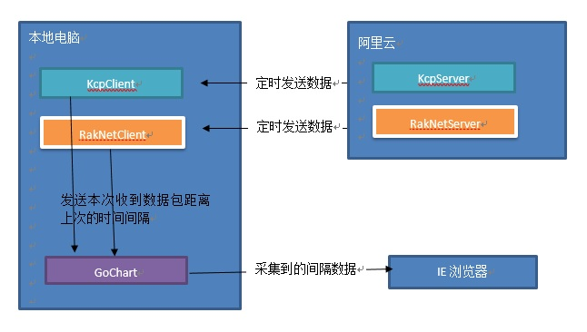

# test_udp

测试比较 kcp 、 raknet、tcp 等库

## 测试方法

- 阿里云上部署 kcpserver 、 raknetserver 各1个进程
- server 都会以 `一定频率` 发送 400 字节的数据包 (如 66 毫秒)
- 本地电脑各自开1个 kcpclient 、 raknetclient
- client 记录上次收到包时间与本次收到包时间的间隔
- client 会把间隔发送给 gochart
- IE 可以把 gochart 的数据按图表方式显示

## 测试部署

## 进程开启顺序

1. 阿里云上执行 bin/test1/start_66.sh
2. 再本地执行 bin/test1/client.bat
3. 打开 IE ，输入 <http://127.0.0.1:8000/?query=chart>

_(脚本内IP做了硬编码，根据实际情况需改之)_

## 模拟弱网环境

- bin/netem_1.sh

  对下行（服务器输出方向）做弱网模拟

- bin/netem_2.sh

  对上、下行（服务器输出方向、输入方向）都做做弱网模拟

_(脚本内网卡名字做了硬编码，根据实际情况需改之)_

## 编译

- gochart

  执行 gochart 目录中的 build.bat 即可

  生产2进制文件在 bin 目录下

  _(build.bat 中的 GOPATH 路径根据本地目录应该要做修改)_

- kcpserver

  需要安装 docker

  执行 kcp 目录中的 ./build.sh 即可

  生产2进制文件在 bin 目录下

- kcpclient

  执行 kcp 目录中的 ./build.bat 即可

  生产2进制文件在 bin 目录下

  _(build.bat 中的 GOPATH 路径根据本地目录应该要做修改)_

- raknetserver

  需要安装 vcpkg

  执行 vcpkg install boost-asio

  执行 raknet 目录下的 ./build.sh

  生产2进制文件在 bin 目录下

- raknetclient

  需要安装 vcpkg、vs2017

  执行 vcpkg install boost-asio

  通过 vs2017 打开 raknet cmkae目录

  生产2进制文件在 bin 目录下
  
  
## 测试结果

参见：https://blog.csdn.net/u013272009/article/details/81430262

